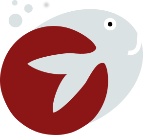

# Docfish

Docfish is a simple application for marking up text and images with words. The initial deployment is for Stanford University to annotate all text and images provided by Pubmed Central (PMC) Pubmed's Open Access database of articles, updated on a weekly database.




## The Goals of DocFish: Annotation and Markup of Images and Text
We can broadly define the machine learning annotation task as needing to markup or annotate images. Specifically, we want an application and standards to meet the following goals:

 - standard storage of images and text, to be available for annotation and then distribution
 - web interfaces to allow for the physical annotation tasks
 - standard data structures to serve the labeled data
 - programmatic endpoints (API/functions) to serve both data structures and data from storage


The functions of markup and annotation are defined below.

## Markup
A markup is any kind of mark on an image or text that designates a point of attention, without specificity of the salience.

 - markup of images. Eg, (circle an area, because it's important). This becomes a helper for some unsupervised machine learning that wants direction about more salient parts of an image.
 - markup of text. Akin to images, this means highlighting some subset of text, and nothing more, and this highlight indicates importance.

## Annotation
Annotation means a specific labeling, either an entire image or a subset of it, with a term, phrase, or condition.

### Global Annotation
 - global annotation of images: means ascribing an entire label to a single image
 - global annotation of text: means ascribing an entire label to a text body

### Segmented Annotation
 - segmented annotation of images: means ascribing a label to a subset of pixels in an image
 - segmented annotation annotation of text: means ascribing a label to a subset of words in a text body.


# Deployment
This application is intended to work with Google APIs, and so it should be deployed on Google Cloud. I used compute engine to run a docker compose application, with default credentials from the instance. 


## Secrets
You should make a file called `secrets.py` in the [docfish](docfish) folder, under which you should first define the Google Storage Bucket that has the images and text associated with the application.

```
GOOGLE_BUCKET_NAME="mybucket"
```

# Infrastructure Details

## Database 

### Uploading Data
Upoading datasets is supposed by the wordfish-standard, which is implemented in [som-tools](https://www.github.com/vsoch/som-tools). While this functionality is not currently turned on, it is implemented and working given some future use case when Stanford researchers want to upload their own images and texts.


### Table Models
The original application database supported storage of collections, entities, images, and text from within the database itself, however this does not scale well. This updated version takes advantage of Google Cloud Storage and Datastore, meaning that images and text are stored on the cloud, and programatically available to annotate or markup via the DocFish web application here.


**Collection**
A collection is a grouping of entities, mainly used for organizing sets of text and images, and handling permissions to access them.
 - owner: 
 - things: one or more entities associated with the collection


**Entity**
An entity is a person, place, whatever, that has one or more associated text and image things. This is how we group text and images together under some common identifier.
 - text: one or more text objects associated with the entity 
 - images: one or more image objects associated with the entity
 - metadata: a JSONfiled with any important (site specific or otherwise) metadata


**Text**
A "text" object is broadly a parent class that holds a chunk of text, namely the original (raw) text content, and then markups of it.
 - original: is the original text, without any parsing or editing. 
 - text_markups: one or more TextMarkup objects of the text
 - metadata: a JSONfiled with any important (site specific or otherwise) metadata


**Image**
An "image" is broadly a parent class that holds an original (raw) file, and then markups of it.
 - original: is a file object to the original thing uploaded. In the case of a web format, it might be a different sampling, etc. In the case of a 2D or 3D nifti, it would be the nifti.
 - image_markups: one or more ImageMarkup objects of the image
 - metadata: a JSONfiled with any important (site specific or otherwise) metadata


**ImageMarkup**
A markup is like a transparent layer that fits to its matched image (see Image.image_markups). By default of being a markup, it is intended to be used on a 2D image, which means that if a markup is created for a 2D image, what is being created is a slice. To support this, each markup stores a file location (for the overlay image) along with a metadata field that can support an x,y,z layer, or more broadly, some transformation matrix for converting the 2D or 3D image to the 2D one.
 - overlay: is the transparent layer with the markup
 - transformation: is a metadata field with the transformation applied to the original image to produce the overlay dimension / slice. We will need to properly define these fields when we know what transformations are needed - for the database a JSONfield is appropriate here.


**TextMarkup**
A text markup is a specific subset of locations in the text, not associated with any label, stored with a Text object (see Text.text_markup). The markup is just a list of start and stop locations, based on some delimiter in the text (default is a space)
 - delimeter: the delimiter to determine the indexing of the text (charfield)
 - locations: a list of start and stop locations for the markup (JSONfield)


**Annotation**
An annotation is a parent class to hold an allowed_annotation, and then the subclasses hold the specific content pointers (to an image or text). Broadly, an annotation is like a markup, but carries with it a specific label, one from a group of AllowedAnnotations
 - allowed_annotation
 - user: the user is the annotator of the image, the person who ascribed the allowed_annotation to the image or text markup

**AllowedAnnotation**
An allowed annotation, akin to the current model, is a broad named label and a subset of options that can be chosen by the user. An allowed annotation can be shared between text and images.
 - name
 - label
 - description

**ImageAnnotation**
An image annotation is equivalent to an image markup (pointing to a matched image) but it has the additional allowed annotation. If the overlay is empty for the ImageMarkup, it is assumed to describe the whole image.
 - image_markup

**TextAnnotation**
A text annotation is equivalent to a text markup (pointing to a matched Text) but it has the additional allowed annotation. If the locations list is empty, it is assumed to describe the whole body of text.
 - text_markup


## Goal 2: Standard Storage Model
The database model must "dump" nicely into a flat storage model, meaning that a user can download a set of images and text and immediately / easily perform machine learning. This model also plugs into something like Google Storage, which is the likely place that results will be moved around to.

   
     collection1/
       collection1.json
     collection2/
       entity1/
       entity2/
         images/
            image1/
              image1.json
              image1.png
              overlay1.png
            image2/
         text/
            text1/
            text2/
              text2.json
              text2.txt              
         entity2.json


Notes:
- The json files, under the collection and entity folders, hold metadata pertaining to the entity or collection.
- we will want some kind of unique identifier to be used across the database - I'm not sure yet what this should look like.


### File Naming
The data retains meaning based on its presence in a collection folder. We know that an entity 1 belongs to collection 1 because it's in that folder. This means that we will get a lot of information based on the file hierarchy, which also makes a lot of sense given how most analyses are done. For example, by looking at the file path:


     collection1/entity1/images/image1/overlay1.png

I know that overlay 1 is a part of collection1, without needing to name the file itself `collection1-entity1-images-image1...` etc. This framework fits nicely with the Google Storage model, where "folders" aren't really folders but just file pathy things.


The above example supports storing all of the kinds of data formats, but is combined into one simple format. For example, let's look at what each of the different objects would look like:


### An Image Markup
This is an image with some markup, without any labels.

     collection1/
       collection1.json
       entity1/
         images/
            image1/
              image1.png
              overlay1.png

The image is stored as a flat file, and the markup is an overlay within the same folder. There is no need for an `image1.json` because there is no specific labeling. If there are multiple overlays (perhaps many users have created markup) it would look like this:


     collection1/
       collection1.json
       entity1/
         images/
            image1/
              image1.png
              overlay1.png
              overlay2.png
              overlay3.png


### An Image Annotation
Equivalently, a markup changes immediately into an annotation by adding an associated json file:

     collection1/
       collection1.json
       entity1/
         images/
            image1/
              image1.png
              overlay1.png
              image1.json
              overlay2.png
              overlay3.png


The image1.json should have the annotation name, label, and one or more users that have ascribed it to the particular overlay:


     {

        "annotation":
                    
                    { 

                      "name":"RX_PRESENT",
                      "overlay":"overlay1.png",
                      "label":"RX_positive",
                      "annotators": [ 'mlungren',
                                    'mlungren2', ... ]

                    },

                    {
                      
                     "name":"RX_PRESENT",
                     "overlay":"overlay1.png",
                     "label":"RX_negative",
                     "annotators": [ 'mchen1',
                                    'mchen22', ... ]

                    } ...

     }


Note that an annotation can be specific to one or more overlays. However, what about a "global annotation" that implies the whole image (meaning an empty overlay?) We would just specify that the annotation is not associated with an overlay. In the example below, the second annotation has been done globally:


     {

        "annotation":
                    
                    { 

                      "name":"RX_PRESENT",
                      "overlay":"overlay1.png",
                      "label":"RX_positive",
                      "annotators": [ 'mlungren',
                                    'mlungren2', ... ]

                    },

                    {
                      
                     "name":"RX_PRESENT",
                     "label":"RX_negative",
                     "annotators": [ 'mchen1',
                                    'mchen22', ... ]

                    } ...

     }


### A Text Annotation
Within an entity folder, we also have a folder for text. This is what a text markup looks like, meaning labels to describe an entire text file

     collection1/
       collection1.json
       entity1/
         images/
         text/
            text1/
            text2/
              text2.json
              text2.txt              


### Export Options

#### Export Option 1: Whole Text with Global Annotations
Text can be similar, except we simply provide a list of annotations (represented again in json) to go along with the text (represented again in a txt file).

     {

        "annotation":
                    
                    { 

                      "name":"RX_PRESENT",
                      "label":"RX_positive",
                      "annotators": [ 'mlungren',
                                      'mlungren2', ... ]

                    },

     }


#### Export Option 2: Whole Text with Global and Segmented Annotations
I would expect that most datasets will have a reporting task that is for whole annotation of the report OR highlighting some subset, but if it's the case that both are needed, the folder would have the equivalent text2.txt file, but then the annotations would have optional `location` field with a start, stop, and delimiter:


          {

          ...


                    {
                      
                     "name":"RX_PRESENT",
                     "location": {"start":10,
                                  "stop":25,
                                  "delimiter":"/w"},  # should this be a list?
                     "label":"RX_negative",
                     "annotators": [ 'mchen1',
                                    'mchen22', ... ]

                    } ...

     }


#### Export Option 3: Segmented Text
In the case that we are only annotating pieces of text, we don't need to preserve the entire text file. We can store the snippets with the annotation objects, all in the json file:


     collection1/
       collection1.json
       entity1/
         images/
         text/
            text1/
            text2/
              text2.json


and instead represent the text in the json itself:

     {

        "annotation":
                    
                    {
                      
                     "name":"RX_PRESENT",
                     "text": "This report is indicative of having PE..."
                     "label":"RX_negative",
                     "annotators": [ 'mchen1',
                                    'mchen22', ... ]

                    } ...

     }


Again, this last format is ideal for segmented annotation only, without needing to export the original entire text.


## Goal 3: Programmatic Access
The database and storage models detailed above must logically plug into a programatically accessible format, which means a RESTful API. A user would likely be interested in the following endpoints:

Given the base URL of https://doc.fish:

### Collections

**/api/collections

     { "collections":

        {"name": "collection1",
         "owner": "vanessasaur",
         "metadata" ... },

        {"name": "collection1",
         "owner": "vanessasaur",
         "metadata" ... }

      }


### Entities
A user wanting a set of entities would query for entities within the collection:

**/api/collection/1/entity

     { "entity":

        {
         
        "id": "12345-6",
        "images": [ ... ],
        "text": [ ... ] 

        },

     }


And then specifying a particular id would return the complete set of images and text for the entity, and  (likely) some redundant information about the collection

**/api/collection/1/entity/123

     { "entity":

        { "collection": 

          {
           "name": "collection1",
           "owner": "vanessasaur",
           "metadata" ... },
          }
    
       },

     { "images":

        {

         "id": "12345-6",
         "metadata" ... ,
         "image": "image1.png"

        },

      }

         "text": [ ... ] 

         },

     }


## Development

You will want to [install Docker](https://docs.docker.com/engine/installation/) and [docker-compose](https://docs.docker.com/compose/install/) and then build the image locally:


```
docker build -t vanessa/docfish .
```

Then start the application:

```
docker-compose up -d
```

### Secrets
There should be a file called `secrets.py` in the [dino](dino) folder, in which you will store the application secret and other social login credentials. First, create this file, and add the following variables:


#### Django secret key
You can use the [secret key generator](http://www.miniwebtool.com/django-secret-key-generator/) to make a new secret key, and call it `SECRET_KEY` in your `secrets.py` file, like this:

      
          SECRET_KEY = 'xxxxxxxxxxxxxxxxxxxxxxxxxxxxxxxxxxxxxxxxxxxxxxxxxxxx'


#### Setting up Social Logins
For users to connect to Github, you need to [register a new application](https://github.com/settings/applications/new), and add the key and secret to your `secrets.py` file like this: 


      http://psa.matiasaguirre.net/docs/backends/github.html?highlight=github
      SOCIAL_AUTH_GITHUB_KEY = ''
      SOCIAL_AUTH_GITHUB_SECRET = ''
      SOCIAL_AUTH_GITHUB_SCOPE = ["repo","user"]


Specification of the scope as 'user' and 'repo' is hugely important, because we can't make webhooks without write access to the repo! Note that the integration is commented out in the login template for twitter login, and this is done so that users authenticate with Google or Github from the getgo, since we need both for storage and repos, respectively. If you want to develop something / change this, you can add those OAUTH credentials as well, in this format:


      # http://psa.matiasaguirre.net/docs/backends/twitter.html?highlight=twitter
      SOCIAL_AUTH_TWITTER_KEY = ''
      SOCIAL_AUTH_TWITTER_SECRET = ''

Read more about the different [backend here](http://psa.matiasaguirre.net/docs/backends).


#### Setting up SAML Auth

In `secrets.py` you will need to define the variables specified [here](http://python-social-auth.readthedocs.io/en/latest/backends/saml.html), and that includes generating your certificate, which looks something like:

```
openssl req -new -x509 -days 3652 -nodes -out saml.crt -keyout saml.key
cat saml.key
mv saml.crt /etc/ssl/certs
mv saml.key /etc/ssl/private
```

and then generate the `metadata.xml` by going to `https://doc.fish/saml.xml`. Usually institutions have different portals for submitting metadata / getting information about SAML, for Stanford the information is via the [SAML SP Service Provider Database](https://spdb.stanford.edu/).
